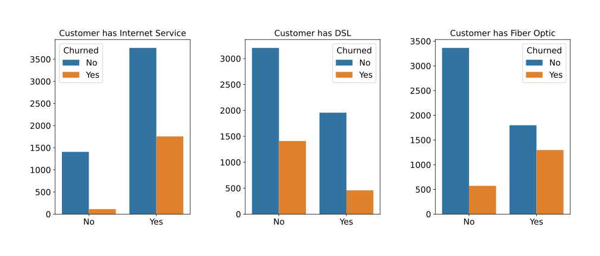

# Telco Customer Churn

## *Table of Contents*

1. [Business Case](#business-case)
2. [Project Overview](#project-overview)
3. [Data](#data)
4. [Resources](#resources)
5. [EDA](#eda)
6. [Predictions](#predictions)
7. [Conclusion](#conclusion)

## *Business Case*

- Customer churn is a major problem for many industries
- Customer churn happens when customers decide to stop purchasing products/services from an organization
- It is an integral parameter and one of the most important metrics for all organizations
- Losing customers requires gaining new customers to replace them
- However, acquiring a new customer could cost almost 10 times more than retaining an existing one
- As a result, customer churn can prove to be a roadblock for any exponentially growing organization
- Therefore, a retention strategy should be decided in order to avoid an increase in customer churn rates

## *Project Overview*

- In this project, we will analyse the behaviour of the customers of a telco company
- Our goal is to identify some common characteristics and patterns among the churned customers
- Then, we will try to see if we can successfully detect and prevent churn using machine learning
- Finally, we will decide what would be the best model for the company to deploy in order to avoid churn

## *Data*

- The data were acquired from [kaggle](https://www.kaggle.com/blastchar/telco-customer-churn)
- It include customer account information, demographics, services they have signed up for, etc.
- The dataset was quite imbalanced, with only about $25\\%$ of the customers having churned

## *Resources*

- Packages: `numpy`, `pandas`, `matplotlib`, `seaborn`, `scipy`, `statsmodels`, `sklearn`, `imblearn`, `lightgbm`
- Software: Jupyter Notebook

## *EDA*

- In this section, we analyze the data using visual techniques
- Specifically, we try to understand the relationship between different features and the target variable
- We look for trends, patterns and common characteristics between customers to find interesting insights

### Demographics

- It seems that churn is not a matter of gender
- However, non-senior customers and customers without partners or dependents are more likely to churn

### Tenure & Monthly Charges

- We see that recent clients with smaller tenure, are more prone to churn
- In addition, clients with higher monthly charges are more likely to churn
- Finally, the volume of total charges doesn't seem to be an indicator about whether a customer will churn

### Internet Service

- Customer with Internet service in general, but also with fiber optic option, seem more likely to churn

### Contract Type & Tenure

- Customers with short-term contracts (month-to-month) are more prone to churn
- We see that the majority of them, tend to leave the company after 1-2 months
- On the other hand, customers with longer contracts seem to be more loyal

## *Predictions*

|    | Precision | Recall | F1 Score | ROC | Accuracy |
| :- | :-------: | :----: | :------: | :-: | :------: |
| LogisticRegression | 0.599045 | 0.671123 | 0.633039 | 0.754245 | 0.793177 |
| SVC | 0.537611 | 0.649733 | 0.588378 | 0.723705 | 0.758351 |
| RandomForest | 0.539683 | 0.636364 | 0.584049 | 0.719924 | 0.759062 |
| LightGBM | 0.547619 | 0.614973 | 0.579345 | 0.715521 | 0.762615 |
| KNN | 0.443144 | 0.708556 | 0.545267 | 0.693097 | 0.685856 |

## *Conclusion*

What is the best model? To answer this, let's try to understand some of the metrics in our case.

**Precision:** How many of the predicted customers had actually churned?  
**Recall:** How many of the customers that had actually churned the model predicted right?  
**F1 Score:** The harmonic mean of precision and recall.

Since Logistic Regression has the highest F1 score, it has the best overall performance and theregore provides the right trade-off between precision and recall. However, if the company wants to choose a model to deploy in the real world, it will have to make a trade-off between the amount of revenue it wants to retain and the amount of revenue it is willing to spend on customer retention programs. This trade-off, is the result of the trade-off between precision and recall.

Therefore, if the company wants to retain more revenue, it should choose a model with higher recall - and lower precision - such as ***K-Nearest Neighbors***. This will result in a higher number of false positives, which will cause the company to include customers who will not churn in its retention programs and increase its spending. However, if the company decides to retain a decent amount of revenue without spending a lot on retention programs, then it should choose a model with higher F1 score. In this case, ***Logistic Regression*** would be the best choice.
